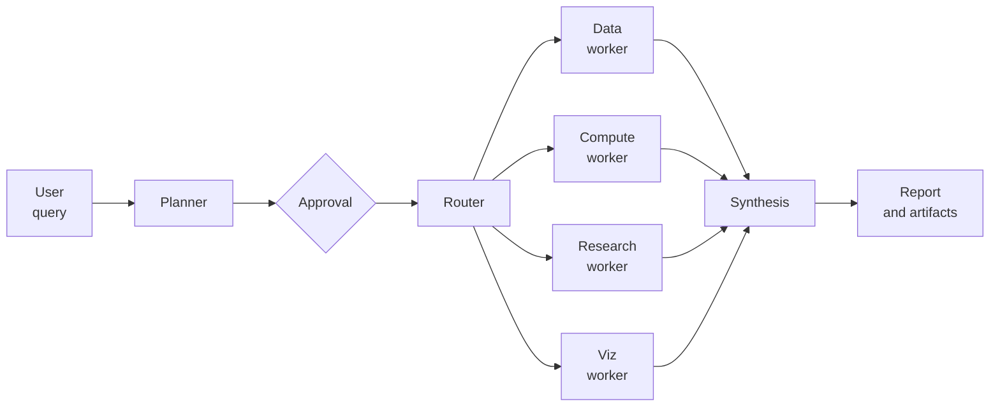

# HEP-multiagent

HEP-multiagent is a LangGraph-based research agent for scientific workflows. It turns an open-ended research request into a plan, routes work to specialized workers, calls external MCP tool servers, and writes a final report with execution artifacts.

The package is intentionally an orchestrator, not an MCP server process manager. Start each MCP server independently and pass its HTTP endpoint to the agent.

## Why Use It

- Plan-and-execute workflow for multi-step scientific tasks
- Specialized workers for data access, computation, literature search, and visualization
- MCP integration for domain tools over `streamable_http`
- Optional human approval before execution
- Reproducible outputs: report, citations, execution log, and replay notebook

## Install

```bash
pip install -e .
```

Set an OpenAI-compatible API key:

```bash
export OPENAI_API_KEY=...
```

## Quickstart

```python
import asyncio
import os

from langchain_openai import ChatOpenAI
from hep_multiagent import Agent


async def main():
    llm = ChatOpenAI(
        model=os.environ.get("OPENAI_MODEL", "gpt-4o-mini"),
        api_key=os.environ["OPENAI_API_KEY"],
    )

    agent = await Agent(
        llm=llm,
        mcp_servers=[{"name": "hep-tools", "url": "http://localhost:8000/mcp"}],
    )

    result = await agent.run(
        "Find recent papers on dark matter detection and summarize the main methods.",
        output_dir="./output",
    )
    print(result["final_report"])


asyncio.run(main())
```

There is also a runnable script in `examples/quickstart.py`.

## Demo Notebooks

The root notebooks show the same agent interface with specific MCP servers:

| Notebook | MCP endpoint variable | Purpose |
|----------|-----------------------|---------|
| `demo.ipynb` | `HEP_MCP_SERVER_URL` | General MCP tool-server walkthrough |
| `demo_kb.ipynb` | `KB_MCP_SERVER_URL` | Knowledge-base MCP workflow |
| `demo_mcmc.ipynb` | `MCP_KE_SERVER_URL` | Cosmology/MCMC workflow with `mcp-ke` |
| `demo_microlensing.ipynb` | `MICROLENSING_MCP_SERVER_URL` | Microlensing MCP workflow |

The demo notebooks use ARGO as the LLM backend through LangChain's OpenAI-compatible `ChatOpenAI` client:

```bash
export ARGO_BASE_URL=...
export ARGO_API_KEY=...
export ARGO_MODEL=gpt-5.5
```

Other OpenAI-compatible LLM providers can be used by changing the `ChatOpenAI` configuration cell. Each notebook assumes the MCP server is already running. The notebook connects to the endpoint; it does not install or launch the server.

## MCP Servers

`mcp_servers` is a list of running MCP endpoints:

```python
mcp_servers=[
    {
        "name": "hep-tools",
        "url": "http://localhost:8000/mcp",
        "transport": "streamable_http",
        "headers": {"Authorization": "Bearer ..."},
    }
]
```

Fields:

| Field | Required | Description |
|-------|----------|-------------|
| `url` | yes | HTTP MCP endpoint |
| `name` | no | Stable server name for tracing |
| `transport` | no | `streamable_http` |
| `headers` | no | Request headers for authentication |

Start tool servers outside HEP-multiagent and expose them through one of the supported HTTP transports.

## Outputs

Each run writes to `output_dir`:

| File | Purpose |
|------|---------|
| `execution_log.md` | Planner, worker, and tool-call trace |
| `execution.ipynb` | Replay-oriented notebook for generated code and artifacts |
| `references.bib` | BibTeX entries collected through citation tools |
| `report.tex` / `report.pdf` | Final report when LaTeX generation is enabled |

## Feature Toggles

Optional behavior is controlled at initialization with `AgentFeatures`:

```python
from hep_multiagent import Agent, AgentFeatures

features = AgentFeatures(
    plan_approval=False,
    python_execution_approval=False,
    lesson_memory=False,
    report=True,
    citations=True,
    execution_log=True,
    replay_notebook=True,
    issue_tracking=True,
)

agent = await Agent(llm=llm, mcp_servers=mcp_servers, features=features)
```

For experiment sweeps, the same settings can be passed as a plain dictionary:

```python
agent = await Agent(llm=llm, features={"lesson_memory": False, "replay_notebook": False})
```

| Toggle | Default | Effect |
|--------|---------|--------|
| `plan_approval` | `False` | Require approval before executing a plan |
| `python_execution_approval` | `False` | Require approval before built-in Python execution |
| `lesson_memory` | `True` | Recall/save lessons from failed worker attempts |
| `report` | `True` | Generate LaTeX/PDF report artifacts |
| `citations` | `True` | Track BibTeX references |
| `execution_log` | `True` | Write `execution_log.md` |
| `replay_notebook` | `True` | Write `execution.ipynb` |
| `issue_tracking` | `True` | Give workers the `log_issue` diagnostic tool |

## Architecture



## Development

```bash
pip install -e ".[dev]"
pytest
```

Run MCP endpoint tests only when a server is available:

```bash
export HEP_MCP_SERVER_URL=http://localhost:8000/mcp
pytest tests/test_mcp_smoke.py
```
