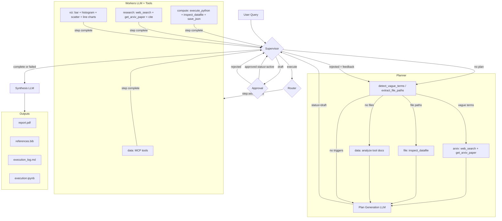

# hep-multiagent

Domain-agnostic multi-agent framework for scientific research queries.

## Architecture



### Supervisor (deterministic)

Checks state and returns `next_action`:

| Condition | Action |
|-----------|--------|
| No plan exists | `plan` |
| Plan status=draft, not approved | `await_approval` |
| User rejected plan | `plan` (with feedback) |
| All steps completed OR any step failed | `synthesize` |
| Ready steps exist (dependencies met) | `execute` |

### Router (deterministic)

Runs only on `execute` action:
1. Calls `get_ready_steps(plan)` - returns steps where all `depends_on` are completed
2. Picks first ready step, sets status to `running`
3. Routes to worker matching step's `worker_type` field

### Planner Phases

1. **Detection**: `detect_vague_terms()` scans for subjective words (interesting, unusual, significant...); `extract_file_paths()` finds .hdf5, .csv, etc.
2. **Consultation** (conditional):
   - **arxiv**: If vague terms → search literature for quantitative definitions
   - **file**: If file paths → describe columns and structure
   - **data**: If no files → explain available MCP data sources
3. **Plan Generation**: LLM creates JSON plan with consultation context embedded
4. **Plan Construction**: Sets `status=draft`, step status `ready` if no deps else `pending`

### Workers

Each worker runs LLM with bound tools in a loop until no more tool calls:

| Worker | Tools | Purpose |
|--------|-------|---------|
| data | MCP tools only | Fetch/load data via MCP servers |
| compute | `execute_python`, `inspect_datafile`, `save_json` + MCP | Transform data, compute statistics |
| research | `web_search`, `get_arxiv_paper`, `cite`, `save_json` + MCP | Literature search, find definitions |
| viz | `create_bar_chart`, `create_histogram`, `create_scatter_plot`, `create_line_plot`, `list_data_keys` + MCP | Publication-quality plots |

## File Structure

```
src/hep_multiagent/
├── config.py           # Component registry (THE MANIFEST)
├── graph.py            # LangGraph workflow assembly
├── agent.py            # Agent class (init + run)
├── state.py            # AgentState TypedDict + helpers
├── worker.py           # Shared execution utilities
├── mcp.py              # MCP tool loading
│
├── nodes/              # Graph nodes
│   ├── planner.py      # Plan generation + consultation
│   ├── supervisor.py   # Route next action
│   ├── router.py       # Pick ready step → worker
│   ├── worker.py       # Execute step with tools
│   └── synthesis.py    # Generate final report
│
├── workers/            # Worker prompts + tools
│   ├── data.py         # Data retrieval
│   ├── compute.py      # Python sandbox execution
│   ├── research.py     # arXiv/web search
│   └── viz.py          # Visualization
│
├── consultants/        # Pre-planning research
│   ├── arxiv.py        # Literature lookup
│   ├── data.py         # Data source discovery
│   └── file.py         # File structure inspection
│
└── features/           # Pluggable features
    ├── approval.py     # Human-in-loop approval
    ├── checkpoint.py   # State persistence
    ├── logger.py       # Execution logging
    ├── notebook.py     # Reproducible notebook
    ├── references.py   # BibTeX management
    └── report.py       # LaTeX → PDF
```

## Features

- **Multi-agent orchestration** - Supervisor routes between planner, workers, and synthesis
- **Pre-planning consultation** - Researches vague terms and file structure before planning
- **MCP tool integration** - Load MCP servers with custom environment variables
- **Automatic planning** - LLM creates execution plans from natural language queries
- **Human-in-the-loop approval** - Review and reject plans with feedback for re-planning
- **Specialized workers** - Data retrieval, computation, research, visualization
- **Academic reports** - LaTeX generation with BibTeX citations
- **State checkpointing** - Resume interrupted runs (memory or SQLite)
- **Execution logging** - Step-by-step markdown logs
- **Notebook replay executes the tool calls that produce data, but doesn't re-run the report generation or logging features


## Agent Parameters

| Parameter | Type | Default | Description |
|-----------|------|---------|-------------|
| `llm` | Any | required | LangChain LLM instance |
| `mcp_servers` | List[dict] | `None` | MCP servers with `url`, optional `env`/`args` |
| `approval` | bool | `False` | Human-in-the-loop plan approval |

## Usage

```python
import asyncio
import os
from dotenv import load_dotenv
from langchain_openai import ChatOpenAI
from hep_multiagent import Agent

load_dotenv()

llm = ChatOpenAI(
    model="gpt-4",
    api_key=os.environ.get("OPENAI_API_KEY", "")
)

async def main():
    # Create agent with MCP server (auto-installs from URL)
    agent = await Agent(
        llm=llm,
        mcp_servers=[{"url": "https://github.com/HEP-KE/mcp-ke.git"}],
        approval=True,
    )

    # Run query
    result = await agent.run(
        query="What is the mass distribution of halos at z=0?",
        output_dir="./output_run_001",
    )

    # Resume interrupted run
    result = await agent.run(query, output_dir="./output", resume=True)

asyncio.run(main())
```

## MCP Tool Development

### Function Signature

The multiagent reads the docstring to understand tool capabilities:

```python
from smolagents import tool
import os

@tool
def query_database(query: str, limit: int = 10) -> str:
    """
    Query the cosmology database for simulation data.

    Args:
        query: SQL-like query string (e.g., "SELECT * FROM halos WHERE mass > 1e14")
        limit: Maximum rows to return (default: 10)

    Returns:
        Query results as formatted text, or error message if query fails.
    """
    output_dir = os.environ.get("MCP_OUTPUT_DIR", ".")
    # ... tool logic ...
    return "results as string"
```

**Recomendations:**
- Type hints on all parameters
- Docstring with `Args:` and `Returns:` sections (used by planner/workers for tool selection)
- Return `str` (the LLM consumes tool output as text)
- Handle errors gracefully, return error messages as strings (Some agent systems can handle error systems but all agent systems can handle strings)

### Environment Variables

Pass env vars via server config. `MCP_OUTPUT_DIR` is auto-injected.

```python
agent = await Agent(
    llm=llm,
    mcp_servers=[{
        "url": "https://github.com/HEP-KE/mcp-ke.git",
        "env": {"LLM_API_KEY": "...", "LLM_URL": "..."},
        "args": ["--verbose"],  # optional CLI args
    }]
)
```

## MCP Server Integration Guide

This framework is **MCP server agnostic** - any MCP server using stdio transport that is following the conventions below.

### Quick Reference Card

| Requirement | Specification |
|-------------|---------------|
| Transport | `stdio` |
| stdout | no banners, colors, logs |
| stderr | Use for logging (not captured as tool output) |
| Tool return type | Always `str` |
| Parameter types | Type-hinted (`str`, `int`, `float`, `bool`, `List`, etc.) |
| Docstrings | Required: `Args:` and `Returns:` sections |
| Binary name | Must match package name derived from URL |
| Tool imports | `from package_name import tool_name` must work |
| Output files | Save to `MCP_OUTPUT_DIR` environment variable |


```python
mcp_servers=[{"url": "...", "name": "my_custom_binary"}]
```

### Tool Output Formats

The agent normalizes tool outputs automatically:

```python
# All these work:
return "simple string"                          # → "simple string"
return {"type": "text", "text": "content"}      # → "content"
return [{"text": "a"}, {"text": "b"}]           # → "a\nb"
return ["item1", "item2"]                       # → "item1\nitem2"
```

### Artifact Detection

File paths in tool output are extracted for downstream workers:

```python
# Default extensions tracked:
[".hdf5", ".h5", ".fits", ".csv", ".png", ".pdf", ".jpg", ".txt"]

# Return paths in your output for automatic tracking:
return f"Analysis complete. Saved: {output_dir}/results.csv"
#                                   ^^^^^^^^^^^^^^^^^^^^^^^^
#                                   Extracted as artifact
```

---

## Building Your Own MCP Server

### Minimal Template

```python
# my_mcp_server/__init__.py
from smolagents import tool
import os
import json

@tool
def fetch_data(source: str, limit: int = 100) -> str:
    """
    Fetch data from a source and save to output directory.

    Args:
        source: Data source identifier (e.g., "catalog_v2")
        limit: Maximum records to fetch (default: 100)

    Returns:
        Path to saved JSON file, or error message if fetch fails.
    """
    output_dir = os.environ.get("MCP_OUTPUT_DIR", ".")

    try:
        # Your data fetching logic
        data = {"source": source, "records": [...]}

        # Save artifact to output directory
        output_path = os.path.join(output_dir, f"{source}_data.json")
        with open(output_path, "w") as f:
            json.dump(data, f, indent=2)

        # Return path so downstream workers can use it
        return f"Fetched {len(data['records'])} records. Saved: {output_path}"

    except ConnectionError as e:
        return f"Error: Failed to connect to {source}: {e}"
    except Exception as e:
        return f"Error: {e}"

__all__ = ["fetch_data"]
```

### Pyproject.toml

```toml
[project]
name = "my-mcp-server"

[project.scripts]
my_mcp_server = "my_mcp_server:main"  # Binary name = package name
```

### Developer Checklist

- [ ] stdout (no print statements, banners)
- [ ] All tools have type hints and docstrings with `Args:`/`Returns:`
- [ ] Tools return strings (serialize complex data to JSON)
- [ ] Tools handle errors gracefully (return `"Error: ..."`)
- [ ] Binary name matches package name
- [ ] Tools importable from package root
- [ ] Uses `MCP_OUTPUT_DIR` for file outputs
- [ ] Works with `pip install git+{url}`
